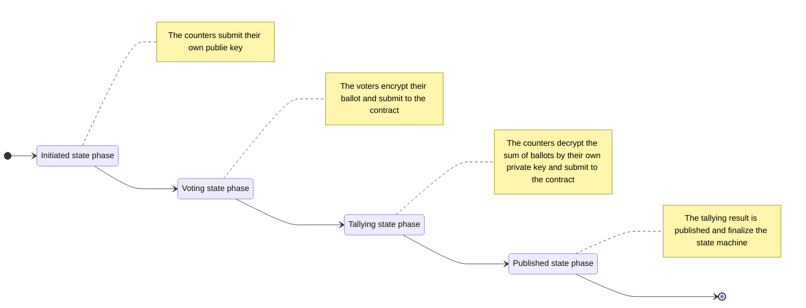
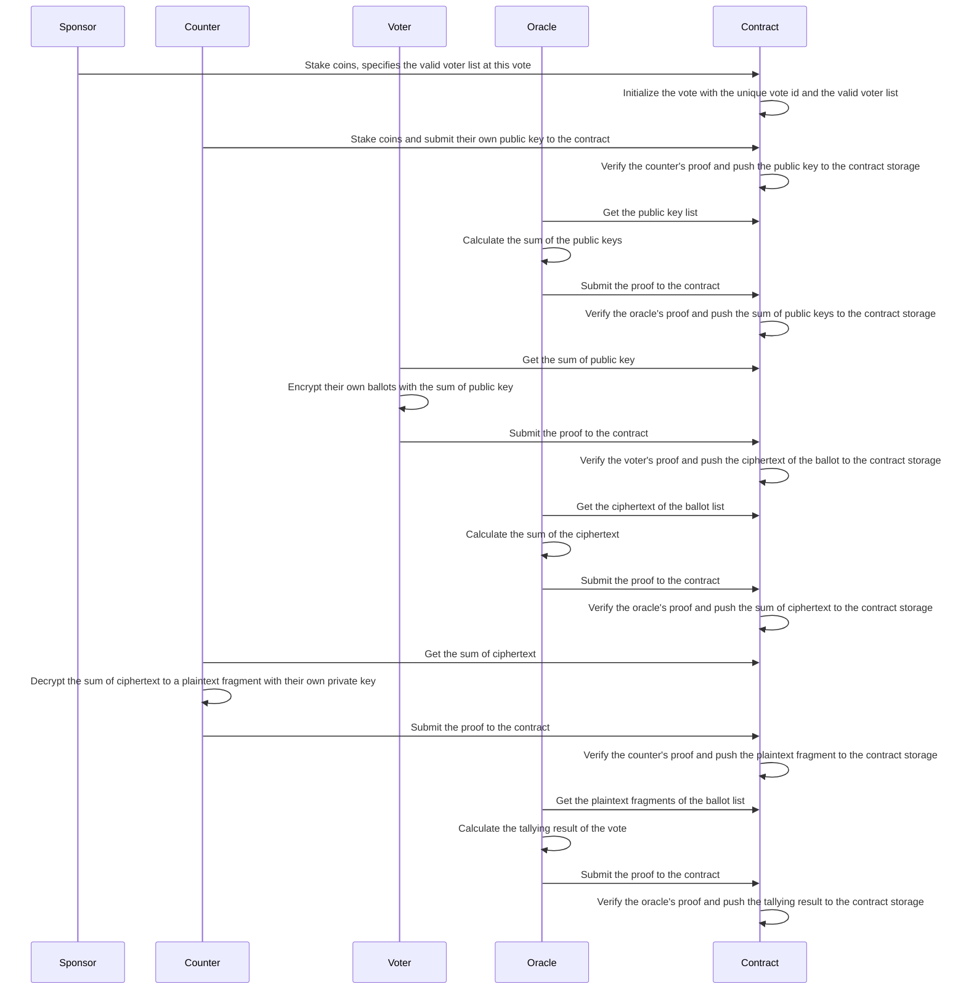

# Avote

**Abstract**
Avote is a decentralized anonymous voting system on the Ethereum blockchain. The voting result and the voter participation can be verified publicly, but individual ballot selections remain cryptographically concealed. Avote operates with three distinct roles.

**Sponsor**
Anyone can be a sponsor by depositing specified amount of ETH and specifies who has voting rights.

**Voter**
Voter who has voting right can submitted his ballot. The ballots are cryptographically concealed so nobody knows what they submit but the ballots can be tallied by counters.

**Counter**
To ensure system anonymity, the system introduces a group of counters as the third party to decrypt and tally ballots. The number of counters must be at least 2. To prevent collusion among counters, both the sponsor and voters can participate as counters by staking a required amount of ETH.

# Foundations of cryptography
### Homomorphic Encryption
To conceal ballots information without affecting tally, we first require a homomorphic encryption algorithm. Serveral different approaches can be employed to achieve this.

**Paillier** is an additively homomorphic encryption scheme which security relies on hardness of the Composite Residuosity Problem(CRP), which is closely related to integer factorization.

**Elgamal** is a multiplicative homomorphic encryption scheme which security relies on hardness of Discrete Logarithm Problem(DLP).

**EC-Elgamal** is like Elgamal that it's security relies on hardness of DLP, but it runs ellipse curve. It's an additively homomorphic encryption. 

We chose EC-Elgamal because it's more efficient due to its smaller key size. More importantly, EC-Elgamal is zero-knownledge-friendly, allowing easily implementation in circom, as well as in c/c++, golang and javascript.

### How does EC-Elgamal work?
In circom, EC-Elgamal is base on baby jubjub curve(one kind of ellipse curves) due to it's zero-knownledge-friendly. It's asymmetric encryption. Each counter $T_i$ generates a private key $d_{T_i}$, and publishes his public key $Q_{T_i} = d_{T_i}G$ on the contract, while G is base point on the curve. Suppose there are $N_T$ counters submit their public key $Q_i$ and the machine state changed to voting.

In voting phase, each voter $V_i$ then use $Q = \sum_{i=1}^{N_T}Q_{T_i}$ as the public key to encrypt their ballots and then publish their ciphertext on the contract. The ciphertext is consists of two points, $(C_{V_i1}, C_{V_i2})$, where 

$$
\begin{cases}
C_{V_i1} = k_{V_i}G \\
C_{V_i2} = M_{V_i} + k_{V_i}Q
\end{cases}
$$

where $k_{V_i}$ is a random big number than less than the suborder of the curve, and $M_{V_i}$ is the point that mapped from the ${V_i}$'s ballot value. There exists an interesting problem that how to map the ballot value $m_{v_i}$ to $M_{V_i}$. We'll discuss this issue later, and for now, we temporarily denote this mapping function as $M=\Phi({m})$.

When all of the voters submit their ballots or the voting phase times out, the oracle will calculate the sum of the ciphertexts as $(C_{V1}, C_{V2})$, while

$$
\begin{cases}
C_{V1} = \sum_{i=1}^{N_V}C_{V_i1} \\
C_{V2} = \sum_{i=1}^{N_V}C_{V_i2}
\end{cases}
$$

In tallying phase, each counter calculate the product of $C_{V1}$ and their own private key $d_{T_i}$, denoted as $\omega_{T_i}=d_{T_i}C_{V1}$, and submit it to the contract.

Finally, the oracle decrypt the plaintext sum of ${M_{V_i}}$, denoted as $M=\sum_{i=1}^{N_V}M_{V_i}$ by calculating $M=C_{V2}-\sum_{i=1}^{N_T}{\omega_{T_i}}$

Why does this hold true? Because

$$
\begin{align}
C_{V2}-\sum_{j=1}^{N_T}{\omega_{T_j}} & =\sum_{i=1}^{N_V}C_{V_i2}-\sum_{j=1}^{N_T}{d_{T_j}C_{V1}} \\
  & =\sum_{i=1}^{N_V}(M_{V_i} + k_{V_i}Q)-\sum_{j=1}^{N_T}({d_{T_j}\sum_{i=1}^{N_V}C_{V_i1})} \\
  & =\sum_{i=1}^{N_V}(M_{V_i} + k_{V_i}\sum_{j=1}^{N_T}Q_{T_j})-\sum_{j=1}^{N_T}(d_{T_j}\sum_{i=1}^{N_V}k_{V_i}G) \\
  & =\sum_{i=1}^{N_V}(M_{V_i} + k_{V_i}\sum_{j=1}^{N_T}d_{T_j}G)-\sum_{j=1}^{N_T}\sum_{i=1}^{N_V}d_{T_j}k_{V_i}G \\
  & =\sum_{i=1}^{N_V}M_{V_i} + \sum_{i=1}^{N_V}\sum_{j=1}^{N_T}k_{V_i}d_{T_j}G-\sum_{j=1}^{N_T}\sum_{i=1}^{N_V}d_{T_j}k_{V_i}G \\
  & =\sum_{i=1}^{N_V}M_{V_i}
\end{align}
$$

### How to map the ballot to the curve?

### Zero-knowledge proof
Zero-knowledge proof(ZKP) is a cryptograph method that allows one party(prover) to convince another party(verifier) that a statement is true without revealing any additional information beyond the validity of the statement itself. The key properties of ZKP is:

**completeness** - If the statement is true, the verifier will be convinced by an honest prover;

**soundness** - If the statement is false, no dishonest prover can convinced the verifier (except with negligible probability);

**zero-knowledge** - The verifier learns nothing beyond the fact that the statement is true.

There are two types of ZKP: interactive ZKP and non-interactive ZKP. The interactive ZKP requires back-and-forth communication, while the non-interactive ZKP needs only one message. Interactive ZKP is hard to be implemented on blockchain, since every message is publicly visible on blockchain. More over, the gas cost may be exceptionally high.

### zk-SNARK
zk-SNARK(Zero-Knowledge Succinct Non-Interactive Argument of Knowledge) is one kind of non-interactive ZKP. It's widely used on blockchain. For details, we recommend you read [An approximate introduction to how zk-SNARKs are possible](https://vitalik.eth.limo/general/2021/01/26/snarks.html) by Vitalik Buterin. Here we just introduce two key properties of zk-SNARK.

**Privacy preservation**
Prover can convince the verifier the statement is true without revealing nothing beyond the statement. One example is Zcach, which is the first blockchain adopted Groth16(like zk-SNARK) for private transactions without revealing sender, receiver and amount.

**verifying efficiently**
Using zk-SNARK to verify the proof is efficient. ZK-Rollup is one of layer 2 scaling methods that it can generate the proof off-chain and verify the proof efficiently on-chain.

Avote benefits from both of these two characteristics. When one voter submits a ballot, he needn't reveal the content of the ballot but convince the verfier in the contract that the ballot is valid. For example, the voter should not vote who is not one of the candidates, or, the voter cannot encrypt the ballot without using the specified public key $Q = \sum_{i=1}^{N_T}Q_{T_i}$ correctly. Also, in tallying phase, the counter can only submit the correct $\omega_{T_i}=d_{T_i}C_{V1}$, where the corresponding public key $Q_{T_i}$ of $d_{T_i}$ is submitted by himself at initiated phase and $C_{V1}$ is the sum calculated before tallying phase.

Some computations on chain is difficult to implement, like calculate the sum of points on the ellipse curve. Circom helps us implement zk-SNARK circuit and generate the stub code like javascript/typescript and solidity to generate and verify a proof easily. For example, when the oracle try to trigger the state of a vote from initiated to 

# State machine

# Workflows

# Attacks
### Double spending attack
### Reentrancy attack
### Overflow attack
### Collusion attack
### Lazy validation attack
### Fake vote attack
### Differential attack

# More details

[Exploring Elliptic Curve Pairings](https://medium.com/@VitalikButerin/exploring-elliptic-curve-pairings-c73c1864e627) --Vitalik Buterin

[An approximate introduction to how zk-SNARKs are possible](https://vitalik.eth.limo/general/2021/01/26/snarks.html) --Vitalik Buterin

[Stars and bars (combinatorics)](https://en.wikipedia.org/wiki/Stars_and_bars_(combinatorics)) --wikipedia.org

[Zero-knowledge proof
](https://en.wikipedia.org/wiki/Zero-knowledge_proof) --wikipedia.org
