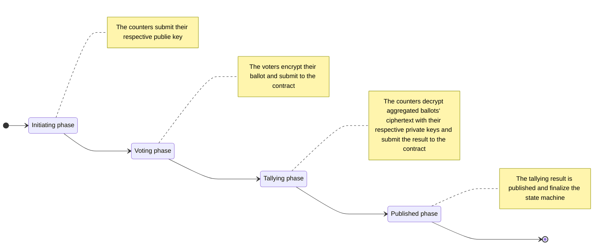
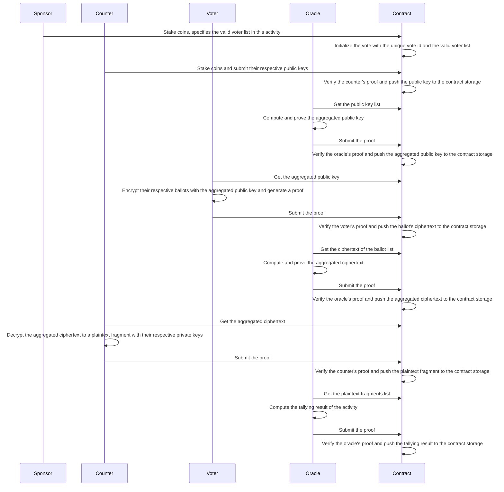

# Avote

> **Abstract**
> 
> Avote is a decentralized anonymous voting system on the Ethereum blockchain. The voting result and the voter participation can be verified publicly, but individual ballot selections remain cryptographically concealed. Avote operates with three distinct roles.
> 
> **Sponsor**: Anyone can become a sponsor by depositing specified amount of ETH and defining who has voting rights.
> 
> **Voter**: Voters who have voting rights can submit their respective ballots. The ballots are cryptographically concealed ensuring that no one can determine others' selections, yet they can be tallied by counters.
> 
> **Counter**: To ensure system anonymity, a group of counters is introduced as a third party to tally ballots. The system requires at least two counters. To prevent collusion among counters, both sponsors and voters can participate as counters by staking a required amount of ETH.

# Foundations of cryptography
### Homomorphic Encryption
To encrypt the ballot information without affecting the tallying process, a homomorphic encryption algorithm is required. Several different approaches can be employed to achieve this.

**Paillier** is an additively homomorphic encryption scheme whose security relies on the hardness of the Composite Residuosity Problem (CRP) - a problem closely linked to integer factorization.

**ElGamal** is a multiplicatively homomorphic encryption scheme whose security relies on the hardness of Discrete Logarithm Problem (DLP).

**EC-ElGamal** is similar to ElGamal in that it's security relies on the hardness of DLP. Howerer it operates over ellipse curve and provides additive homomorphism. 

We selected EC-Elgamal for it's efficiency primarily due to its smaller key size. More importantly, EC-Elgamal is zero-knowledge-friendly, enabling straightforward implementation in Circom, as well as in C/C++, Golang and JavaScript.

### How does EC-Elgamal work?
In Circom, EC-Elgamal is implemented using Baby Jubjub curve(a special elliptic curve) due to its zero-knownledge-friendly properties. As an asymmetric encryption encryption scheme, each counter $T_i$ generates a private key $d_{T_i}$, and publishes their public key $Q_{T_i} = d_{T_i}G$ on the contract, where G is the base point on the curve.

Suppose $N_T$ counters submit their public key $Q_i$ and the system transitions to voting.

During the voting phase, each voter $V_i$ uses the aggregated public key $Q = \sum_{i=1}^{N_T}Q_{T_i}$ to encrypt their ballots and then publish their ciphertext on the contract. The ciphertext comprise two points, $(C_{V_i1}, C_{V_i2})$, where 

$$
\begin{cases}
C_{V_i1} = k_{V_i}G&\text{(1)} \\
C_{V_i2} = M_{V_i} + k_{V_i}Q&\text{(2)}
\end{cases}
$$

where $k_{V_i}$ is a randomly generated large integer less than the curve's suborder, and $M_{V_i}$ is the curve point obtained by mapping the ballot value $m_{V_i}$ of voter ${V_i}$. A critical challenge arises in constructing this mapping from $m_{V_i}$ to $M_{V_i}$. We defer a detailed discussion and provisionally represent the mapping function as $M=\Phi({m})$.

Once all voters submit their ballots or the voting phase timeout is reached, the oracle aggregates the ciphertexts, yielding the combined result as $(C_{V1}, C_{V2})$, while

$$
\begin{cases}
C_{V1} = \sum_{i=1}^{N_V}C_{V_i1}&\text{(3)} \\
C_{V2} = \sum_{i=1}^{N_V}C_{V_i2}&\text{(4)}
\end{cases}
$$

During hte tallying phase, each counter computes the product of $C_{V1}$ and their respective private key $d_{T_i}$, resulting in $\omega_{T_i}=d_{T_i}C_{V1}$, and submits this value to the smart contract.

Finally, the oracle decrypts the aggregated plaintext $M=\sum_{i=1}^{N_V}M_{V_i}$ by computing $M=C_{V2}-\sum_{i=1}^{N_T}{\omega_{T_i}}$

Why does this hold true? Because

$$
\begin{align}
C_{V2}-\sum_{j=1}^{N_T}{\omega_{T_j}} & =\sum_{i=1}^{N_V}C_{V_i2}-\sum_{j=1}^{N_T}{d_{T_j}C_{V1}} \\
  & =\sum_{i=1}^{N_V}(M_{V_i} + k_{V_i}Q)-\sum_{j=1}^{N_T}({d_{T_j}\sum_{i=1}^{N_V}C_{V_i1})} \\
  & =\sum_{i=1}^{N_V}(M_{V_i} + k_{V_i}\sum_{j=1}^{N_T}Q_{T_j})-\sum_{j=1}^{N_T}(d_{T_j}\sum_{i=1}^{N_V}k_{V_i}G) \\
  & =\sum_{i=1}^{N_V}(M_{V_i} + k_{V_i}\sum_{j=1}^{N_T}d_{T_j}G)-\sum_{j=1}^{N_T}\sum_{i=1}^{N_V}d_{T_j}k_{V_i}G \\
  & =\sum_{i=1}^{N_V}M_{V_i} + \sum_{i=1}^{N_V}\sum_{j=1}^{N_T}k_{V_i}d_{T_j}G-\sum_{j=1}^{N_T}\sum_{i=1}^{N_V}d_{T_j}k_{V_i}G \\
  & =\sum_{i=1}^{N_V}M_{V_i} & \text{(5)}
\end{align}
$$

### How is the ballot encoded to the curve?
We require a function $F: {\mu}\rightarrow{\xi}$ mapping plaintext ballots $m\in{\mu}$ to elliptic curve point $M\in{\xi}$, satisfying:
1. Bijectivity, meaning that
   
$$
\forall{m\in{\mu}}, \exists{M\in{\xi}}\text{, such that }M=F(m)\wedge\exists{F^{-1}}\text{, where }F^{-1}(M)=m
$$
      
2. Efficient Computation. Both $M=F(m)$ and $m=F^{-1}(M)$ are computable in polynomial time.
3. Homomorphism. $F$ should preserve the additional homomorphic property: $F(m_1)+F(m_2)=F(m_1+m_2)$

Koblitz encoding is commonly used since it is bijective and allows efficient computation of both $M=F(m)$ and $m=F^{-1}(M)$. Unfortunately, it loses the additional homomorphic property;

Avote simply uses $M=mG$ to map value m to the point on the elliptic curve although there exists a flaw that we need to solve the discrete logarithm problem (DLP) when finding $m$ from $M$. Fortunately, we can search for it in polynomial time. Now, we'll describe how Avote encodes a voter's ballot to a value $m$. We treat a ballot as an $(N_{V}+1)$-ary number.

$$
m_{V_j} = \sum_{i=1}^{N_C}b_{{V_j}{C_i}}*(N_V+1)^{N_C-i} \quad {(6)}
$$

where $N_C$ is the number of the candidates, $N_V$ is the number of the voters, and

$$
\begin{cases}
b_{{V_j}{C_i}}=0, \text{if the voter ${V_j}$ doesn't vote the ${C_i}$'s candidate}&\text{(7)} \\
b_{{V_j}{C_i}}=1, \text{if the voter ${V_j}$ votes the ${C_i}$'s candidate}&\text{(8)}
\end{cases}
$$

In the current version of Avote, each voter selects exactly one candidate, which gives us the constraint equation

$$
\sum_{i=0}^{N_C}b_{{V_j}{C_i}}=1 \quad{(9)}
$$

On the other hand, if we know the value $m$, we can compute 

$$
b_{C_i} = \left\lfloor{\tfrac{m}{(N_V+1)^{N_C-i}}}\right\rfloor \bmod (N_V+1) \quad{(10)}
$$

Our objective is to find $m$ such that $m=F^{-1}(M)$. Given that $m=\sum_{j=1}^{N_V}{m_{V_j}}$, we know $m\leq2^{N_V+1}$. However, this is not represent the minimal upper bound. As previously established, each voter can select exactly one candidate, which introduces the following constraint:

$$
  \sum_{i=1}^{N_C}b_{C_i}=N_V \quad{(11)}
$$

According to the [Stars and bars](https://en.wikipedia.org/wiki/Stars_and_bars_(combinatorics)) theorem, we get the search space size equals

$$
C_{N_V+1}^{N_C-1} = \tfrac{(N_V+1)!}{(N_C-1)!(N_V-N_C+2)!} \quad{(12)}
$$

Finally, we must account for the fact that EC-ElGamal may be vulnerable to differential attacks if:
1. the same random value $k$ is reused, or,
2. $k$ is chosen from a insufficiently large space.

See [differential attack](#differential-attack) for more details.

### Zero-knowledge proof
Zero-knowledge proof(ZKP) is a cryptographic scheme that allows one party(prover) to convince another party(verifier) that a statement is true without revealing any additional information beyond the validity of the statement itself. The key properties of ZKP is:

**completeness** - If the statement is true, the verifier will be convinced by an honest prover;

**soundness** - If the statement is false, no dishonest prover can convince the verifier (except with negligible probability);

**zero-knowledge** - The verifier learns nothing beyond the fact that the statement is true.

ZKPs can be categorized into two types: interactive and non-interactive. Interactive ZKP requires back-and-forth communication, making it impractical for blockchain implementation due to both the public visibility of all messages and prohibitively high gas costs. In contrast, non-interactive ZKP requires only a single message.

### zk-SNARK
zk-SNARK(Zero-Knowledge Succinct Non-Interactive Argument of Knowledge) is one prominent type of non-interactive ZKP widely adopted on blockchain system. For an in-depth understanding, we recommend you reading [An approximate introduction to how zk-SNARKs are possible](https://vitalik.eth.limo/general/2021/01/26/snarks.html) by Vitalik Buterin. Here we focus on introducing two key properties of zk-SNARKs.

**Privacy preservation**
The prover can convince the verifier that a statement is true without revealing any information beyond the statement's validity. A notable example is Zcash, the first blockchain to implement Groth16(a zk-SNARK scheme) for private transactions without revealing the sender, receiver and transction amount.

**verifying efficiently**
In the zk-SNARK schema, the verifier can efficiently verify proofs. ZK-Rollup, a Layer 2 scaling solution, generates proofs off-chain while enabling efficient on-chain verification.

Avote benefits from both aforementioned characteristics. A voter submits a ballot without revealing its value while proving the verfier contract that:
1. The ballot is valid (e.g. not vote a non-candidates);
2. the ballot is properly encrypted using the specified public key $Q = \sum_{i=1}^{N_T}Q_{T_i}$.
   
During the tallying phase, the counters can only submit the valid $\omega_{T_i}=d_{T_i}C_{V1}$ where
1. the corresponding public key $Q_{T_i}$ of $d_{T_i}$ is pre-submitted during initiating phase;
2. $C_{V1}$ represents the aggregated value of all $C_{V_i1}$ before tallying.

Computing the elliptic curve point sums is challenging in solidity due to the lack of native 512-bit integer support and potential overflow risks in 256-bit integer arithmetic operations. Avote's solution is:
1. Implement circuits using Circom to generate interface code (JavaScript/TypeScript/Solidity);
2. Generate the sum proof via JavaScript/TypeScript off-chain;
3. Verify the proof on-chain in Solidity.

The verification occurs when the oracle triggers the state from initiating to voting and from voting to tallying

# State machine

# Workflows

# Attacks
### Differential attack
EC-ElGamal may be vulnerable to differential attacks if the same random value $k$ is reused to encrypt different plaintexts $m$. If we get two different ciphertexts, which are

$$
\begin{cases}
C_1 = kG \quad & \text{(13)}\\
C_2 = M + kQ \quad &\text{(14)}
\end{cases}
$$

and

$$
\begin{cases}
C_{1}{'} = kG \quad  & \text{(15)} \\
C_{2}{'} = M' + kQ \quad  & \text{(16)}
\end{cases}
$$

Subtract equation (14) from equation (16), we get

$$
  C_{2}{'} - C_{2} = M' - M
$$

Since $C_{2}'$ and $C_2$ are publicly known, they reveal the difference between $M$ and $M'$, as well as the difference between $m$ and $m'$. Since $m$ and $m'$ are both small values, an attacker can compute $m'-m$ via brute-force search. Moreover, if the attacker knows either $m$ or $m'$, they can deduce the other easily.

Additionally, if $k$ is too small, an attacker can brute-force $k$ using Eequation (13) and then subsequently recover $M$ according to equation (14).

Therefore, the random $k$ should be generated satisfying:
1. $k$ must never be disclosed to other systems or parties;
2. $k$ must be not be cached in the generator's client and must be erased immediately after ciphertext generation.
3. $k$ must be sampled from a sufficient large space;

### Overflow attack
As we know, the solidity developers must pay special attention to overflow attack, particularly in arithmetic operations between two big integers. Similarly, Circom developers should guard against overflow-like risks since arithmetic operations are performed in a finite field (modular arithmetic). Poor logical design may lead to security issues analogous to overflow attacks. We recommend using Num2Bits or LessThan in circomlib to explicitly restrict the bit length of inputs and carefully auditing the constraint logic to ensure it's not vulnerable to overflow attacks.

### Double spending attack
In the current implementation, the contract stores a list of voter addresses provided by the sponsor for simplicity, ensuring easy verification of voting rights and preventing double-spending attacks.

However, this approach has a privacy flaw: any party, especially the sponsor can track which voters have submitted the ballots. In some cases, voting behavior may be easily inferred, for example, if only one voter has cast a ballot. Additionally, address-based storage is incompatible with cross-chain verification, as external chains cannot validate the whitelist.

To address these, a future version will replace the direct storage of voter addresses with a Merkle tree of the voters' public keys. During voting phase, the voters must:  
1. Compute the hash of the private key;
2. Compute the encrypted ballot with their private keys;
3. Prove:
   - The hashed private key is valid;
   - The encrypt ballot is valid;
   - the public key corresponding to the private key is in the Merkle tree.
4. Submit the hashed private key, encrypted ballot and the proof to the contract.

The contract will additionally store the hashed private key to prevent double-spending while preserving voter anonymity.

### Collusion attack
If all counters collude, they could decrypt all the ballots, compromising the voter privacy. To mitigate this risk, Avote encourages the voters stake tokens and participate as counters if they are concerned about collusion. As a result, during tallying phase, nobody can decrypt the original ballots without these voters' plaintext fragment.

### Lazy tallying attack
If any counter fails to submit his plaintext fragment on time, all parties cannot obtain the tally result. In the current implementation, Avote will slashes the staked tokens of these non-compliant counters, and all of the other parties can withdraw their respective staked tokens.

Maybe Avote will introduce a new "second-tallying phase" in the future versions. During initiating phase, each counter must submit two public keys, one for tallying phase and the other for second-tallying phase. During the voting phase, each voter must submit two ciphertexts using these two public keys respectively. If the contract fails to collect all the plaintext fragments during the talling phase, all tokens staked by the non-compliant counters will be slashed and the second-tallying phase will be activated, enabling threshold decryption to recover the tally result. 

### Fake submitting attack
Both voter and counter may be malicious, for example, voters may submit a encrypted ballot for a nonexisted candidate and counters may submit a fake plaintext fragment without correctly using their private keys. zero-knowledge proof is a crucial technology to prevent such attacks. 

When the voters submit their ballots, they must prove that their respective ballots $b_{V_i}$ satisfies $1\leq{b_{V_i}}\leq{N_C}$, and the data is encrypted with their sepecified public keys collectly. During the tallying phase, the counters must prove that they have the private key corresponding to the public key submitted during the initiating phase and the plaintext fragment is decrypted with this private key correctly.

# More details
[Exploring Elliptic Curve Pairings](https://medium.com/@VitalikButerin/exploring-elliptic-curve-pairings-c73c1864e627) --Vitalik Buterin

[An approximate introduction to how zk-SNARKs are possible](https://vitalik.eth.limo/general/2021/01/26/snarks.html) --Vitalik Buterin

[Stars and bars (combinatorics)](https://en.wikipedia.org/wiki/Stars_and_bars_(combinatorics)) --wikipedia.org

[Zero-knowledge proof](https://en.wikipedia.org/wiki/Zero-knowledge_proof) --wikipedia.org
